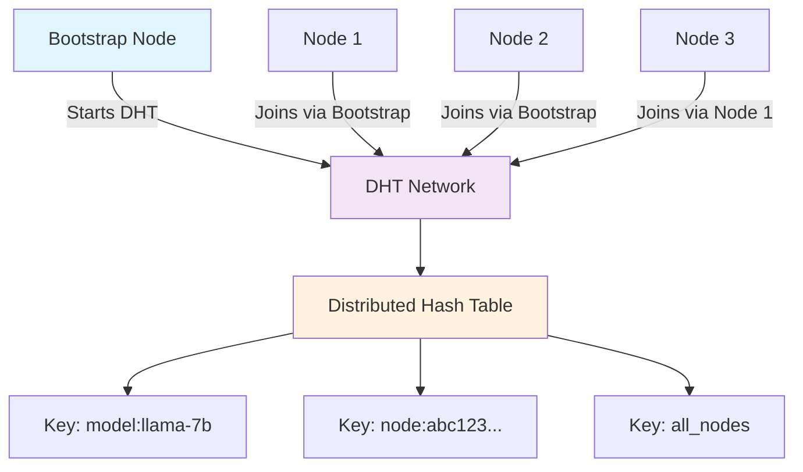
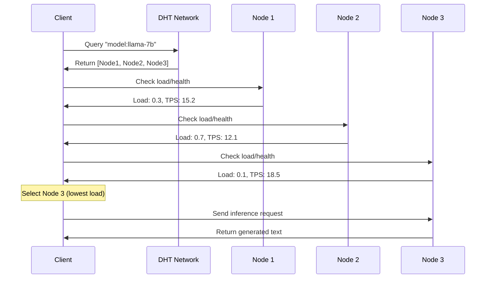
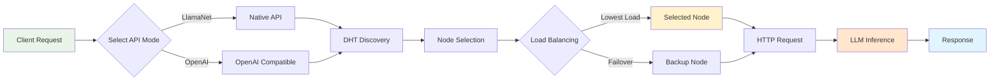

# LlamaNet

LlamaNet is a decentralized inference swarm for LLM models using llama.cpp. It uses Kademlia DHT for truly distributed node discovery without any central registry.

## Features

- **Decentralized DHT-based node discovery** using Kademlia protocol
- Inference nodes that serve LLM models using llama.cpp
- **Async Client Library** for easy integration with async/await support
- Automatic node selection based on load and performance
- No single point of failure - fully distributed architecture
- Docker support for easy deployment

## Requirements

- Python 3.8+
- LLM models in GGUF format
- Docker (optional, for containerized deployment)

## Installation

### From Source

1. Clone the repository:
   ```bash
   git clone https://github.com/yourusername/llamanet.git
   cd llamanet
   ```

2. Install the package:
   ```bash
   pip install --editable . --use-pep517
   ```

### Using pip

```bash
pip install llamanet
```

## Running Locally

### 1. Download a Model

First, download a GGUF model file. For example:
```bash
# Create models directory
mkdir -p models

# Download a GGUF model (example - replace with actual GGUF model URL)
# wget https://huggingface.co/TheBloke/Llama-2-7B-Chat-GGUF/resolve/main/llama-2-7b-chat.q4_0.gguf -O models/model.gguf
# For now, place your .gguf model file in the models directory
```

### 2. Start Bootstrap Node

The first inference node acts as a bootstrap node for the DHT network.

**Using Command Line Arguments:**
```bash
python -m inference_node.server \
  --model-path ./models/model.gguf \
  --port 8000 \
  --dht-port 8001 \
  --node-id bootstrap-node
```

**Using Environment Variables:**
```bash
export MODEL_PATH=./models/model.gguf
export PORT=8000
export DHT_PORT=8001
export NODE_ID=bootstrap-node
export BOOTSTRAP_NODES=""

python -m inference_node.server
```

### 3. Start Additional Inference Nodes

**Using Command Line Arguments:**
```bash
python -m inference_node.server \
  --model-path ./models/model.gguf \
  --port 8002 \
  --dht-port 8003 \
  --bootstrap-nodes localhost:8001
```

**Using Environment Variables:**
```bash
export MODEL_PATH=./models/model.gguf
export PORT=8002
export DHT_PORT=8003
export BOOTSTRAP_NODES="localhost:8001"

python -m inference_node.server
```

### 4. Use the Client

```python
import asyncio
from client.api import Client

async def main():
    client = Client(
        bootstrap_nodes="localhost:8001",
        model="model"  # Use the model name (filename without extension)
    )
    
    try:
        response = await client.generate(
            prompt="What is LlamaNet?",
            max_tokens=150,
            temperature=0.7
        )
        
        if response:
            print(f"Generated by node {response.node_id}:")
            print(response.text)
        else:
            print("Failed to generate text")
    finally:
        await client.close()

if __name__ == "__main__":
    asyncio.run(main())
```

## Quick Start Commands

```bash
# 1. Install dependencies
pip install -e .

# 2. Download a model (example)
mkdir models
# Place your .gguf model file in the models directory

# 3. Start bootstrap node
python -m inference_node.server --model-path ./models/your-model.gguf

# 4. In another terminal, start additional node
python -m inference_node.server \
  --model-path ./models/your-model.gguf \
  --port 8002 \
  --dht-port 8003 \
  --bootstrap-nodes localhost:8001

# 5. Use the client (see examples/simple_client.py for full example)
# Note: client.generate() must be awaited in an async function
```

## Docker Deployment

### Using docker-compose

1. Place your model files in the `models` directory

2. Start the services:
   ```bash
   cd docker
   docker-compose up -d
   ```

This will start:
- Bootstrap node on ports 8000 (HTTP) and 8001 (DHT)
- Additional inference nodes that automatically join the DHT network

### Manual Docker Setup

1. Build the inference image:
   ```bash
   docker build -f docker/inference.Dockerfile -t llamanet-inference .
   ```

2. Start bootstrap node:
   ```bash
   docker run -d -p 8000:8000 -p 8001:8001 \
     -v /path/to/models:/models \
     -e MODEL_PATH=/models/your-model.gguf \
     -e PORT=8000 \
     -e DHT_PORT=8001 \
     -e NODE_ID=bootstrap-node \
     -e BOOTSTRAP_NODES="" \
     --name llamanet-bootstrap llamanet-inference
   ```

3. Start additional nodes:
   ```bash
   docker run -d -p 8002:8000 -p 8003:8001 \
     -v /path/to/models:/models \
     -e MODEL_PATH=/models/your-model.gguf \
     -e PORT=8000 \
     -e DHT_PORT=8001 \
     -e BOOTSTRAP_NODES="host-ip:8001" \
     --name llamanet-node1 llamanet-inference
   ```

## Configuration

### Inference Node

| Environment Variable | Default | Description |
|----------------------|---------|-------------|
| MODEL_PATH           | -       | Path to the GGUF model file |
| HOST                 | 0.0.0.0 | Host to bind the inference service |
| PORT                 | 8000    | Port for the inference HTTP API |
| DHT_PORT             | 8001    | Port for Kademlia DHT protocol |
| NODE_ID              | auto    | Unique identifier for this node |
| BOOTSTRAP_NODES      | ""      | Comma-separated list of bootstrap nodes (ip:port) |
| HEARTBEAT_INTERVAL   | 10      | Interval (in seconds) for DHT updates |
| N_CTX                | 2048    | Context size for the model |
| N_BATCH              | 8       | Batch size for inference |
| N_GPU_LAYERS         | 0       | Number of layers to offload to GPU (0 = CPU only) |

### Client Configuration

```python
client = Client(
    bootstrap_nodes="node1:8001,node2:8001",  # Bootstrap DHT nodes
    model="model-name",                       # Filter by model (optional)
    min_tps=1.0,                             # Minimum tokens per second
    max_load=0.8,                            # Maximum load threshold
    dht_port=8001                            # DHT port for client
)

# Note: All client operations are async and must be awaited
response = await client.generate("Your prompt here")
await client.close()  # Always close the client when done
```

## Architecture

LlamaNet uses a **Kademlia Distributed Hash Table (DHT)** for node discovery:

1. **No Central Registry**: Nodes discover each other through the DHT network
2. **Bootstrap Process**: First node creates the network, others join via bootstrap nodes
3. **Automatic Discovery**: Clients query the DHT to find available inference nodes
4. **Fault Tolerance**: Network continues operating even if nodes leave
5. **Scalability**: Logarithmic lookup time O(log n) for node discovery

## Use Cases & Scenarios

LlamaNet's decentralized architecture makes it ideal for various scenarios where traditional centralized AI services fall short. Here are key use cases where LlamaNet provides significant advantages:

### 🏢 Enterprise & Corporate Environments

#### **Scenario: Multi-Office AI Infrastructure**
A global company with offices in New York, London, Tokyo, and São Paulo wants to provide AI assistance to employees while maintaining data sovereignty and reducing latency.

**LlamaNet Solution:**
- Deploy inference nodes in each office location
- Employees automatically connect to the nearest/fastest node
- No data leaves regional boundaries (GDPR/compliance friendly)
- Automatic failover if one office's node goes down
- Cost-effective scaling without vendor lock-in

```bash
# New York Office
python -m inference_node.server --model-path ./models/company-model.gguf --port 8000

# London Office  
python -m inference_node.server --model-path ./models/company-model.gguf --port 8000 --bootstrap-nodes ny-office.company.com:8001

# Employees use OpenAI-compatible endpoint
openai.api_base = "http://local-llamanet.company.com/v1"
```

#### **Scenario: Hybrid Cloud-Edge Deployment**
A manufacturing company needs AI for both cloud analytics and edge device monitoring, with seamless integration between environments.

**LlamaNet Solution:**
- Cloud nodes for heavy analytics workloads
- Edge nodes for real-time device monitoring
- Automatic load balancing based on request type
- Unified API across all environments

### 🎓 Research & Academic Institutions

#### **Scenario: University Research Cluster**
A university research department wants to share AI resources across multiple labs while allowing each lab to contribute their own compute resources.

**LlamaNet Solution:**
- Each lab contributes nodes with their available hardware
- Researchers access a unified AI service regardless of which lab's hardware is used
- Fair resource sharing with automatic load balancing
- Easy addition of new labs/nodes without central coordination

```python
# Research Lab A contributes GPU node
python -m inference_node.server --model-path ./models/research-model.gguf --n-gpu-layers 35

# Research Lab B contributes CPU node
python -m inference_node.server --model-path ./models/research-model.gguf --bootstrap-nodes lab-a.university.edu:8001

# Researchers use unified client
client = Client(bootstrap_nodes="lab-a.university.edu:8001,lab-b.university.edu:8001")
```

### 🌐 Community & Open Source Projects

#### **Scenario: Community-Driven AI Network**
An open-source community wants to create a shared AI inference network where members contribute compute resources and everyone benefits.

**LlamaNet Solution:**
- Community members run nodes with their spare compute
- Automatic discovery and load balancing
- No central authority or single point of failure
- Contributors can prioritize their own requests

#### **Scenario: Regional AI Cooperatives**
Local businesses in a region want to share AI infrastructure costs while maintaining independence.

**LlamaNet Solution:**
- Each business runs nodes during their off-hours
- Shared access to AI capabilities without individual infrastructure costs
- Data stays within the cooperative network
- Easy scaling as more businesses join

### 🏥 Healthcare & Regulated Industries

#### **Scenario: Hospital Network AI**
A hospital network needs AI for medical imaging analysis while ensuring patient data never leaves their secure network.

**LlamaNet Solution:**
- Deploy nodes within each hospital's secure network
- AI processing happens locally with no external data transfer
- Automatic failover between hospitals in the network
- Compliance with HIPAA and other healthcare regulations

```bash
# Hospital A - Primary node
python -m inference_node.server --model-path ./models/medical-imaging.gguf

# Hospital B - Backup node
python -m inference_node.server --model-path ./models/medical-imaging.gguf --bootstrap-nodes hospital-a.network:8001

# Medical staff use secure internal endpoint
curl -X POST http://internal-ai.hospital.network/v1/chat/completions \
  -d '{"messages": [{"role": "user", "content": "Analyze this X-ray image"}]}'
```

### 🚀 Startups & Small Businesses

#### **Scenario: Cost-Effective AI for Startups**
A startup needs AI capabilities but cannot afford expensive cloud AI services or dedicated infrastructure.

**LlamaNet Solution:**
- Start with a single node on existing hardware
- Scale by adding nodes as the business grows
- No vendor lock-in or expensive API costs
- OpenAI-compatible API for easy integration with existing tools

#### **Scenario: Development Team Collaboration**
A distributed development team needs shared AI assistance for coding, documentation, and brainstorming.

**LlamaNet Solution:**
- Team members contribute nodes from their development machines
- Shared AI assistant available to all team members
- No external dependencies or API costs
- Works offline or in restricted network environments

### 🌍 Geographic & Network Constraints

#### **Scenario: Remote Locations with Limited Internet**
Research stations, ships, or remote facilities need AI capabilities but have limited or unreliable internet connectivity.

**LlamaNet Solution:**
- Local nodes provide AI services without internet dependency
- Mesh network topology for redundancy
- Automatic synchronization when connectivity is available
- Works in completely offline environments

#### **Scenario: Countries with AI Service Restrictions**
Organizations in regions where major AI services are blocked or restricted need local AI capabilities.

**LlamaNet Solution:**
- Completely self-hosted with no external dependencies
- Local language models and cultural customization
- No data sent to foreign servers
- Full control over AI capabilities and policies

### 🔬 Specialized Applications

#### **Scenario: Scientific Computing Clusters**
Research institutions need AI integrated with their existing HPC clusters for scientific workloads.

**LlamaNet Solution:**
- Deploy nodes on HPC cluster nodes during idle time
- Integrate with existing job schedulers
- Specialized models for scientific domains
- Seamless scaling with cluster resources

#### **Scenario: Gaming & Entertainment**
Game developers want to provide AI-powered NPCs and content generation without relying on external services.

**LlamaNet Solution:**
- Deploy nodes in game server infrastructure
- Low-latency AI for real-time game interactions
- No external API dependencies or costs
- Custom models trained on game-specific content

### 💡 Development & Testing

#### **Scenario: AI Application Development**
Developers building AI-powered applications need reliable, cost-effective inference for development and testing.

**LlamaNet Solution:**
- Local development environment with OpenAI-compatible API
- No API rate limits or costs during development
- Easy transition from development to production
- Test with different models and configurations

```python
# Development setup
python -m inference_node.server --model-path ./models/dev-model.gguf

# Application code (works with both LlamaNet and OpenAI)
import openai
openai.api_base = "http://localhost:8000/v1"  # LlamaNet for dev
# openai.api_base = "https://api.openai.com/v1"  # OpenAI for production
```

### 🔒 Privacy & Security Focused

#### **Scenario: Sensitive Data Processing**
Organizations handling sensitive data (legal, financial, personal) need AI capabilities without exposing data to third parties.

**LlamaNet Solution:**
- All processing happens within organization's infrastructure
- No data sent to external AI services
- Full audit trail and control over AI operations
- Compliance with data protection regulations

#### **Scenario: Competitive Intelligence**
Companies need AI assistance for strategic planning without revealing sensitive information to competitors or AI service providers.

**LlamaNet Solution:**
- Private AI network within company infrastructure
- Custom models trained on proprietary data
- No external data leakage or vendor dependencies
- Complete control over AI capabilities and access

## Benefits Summary

| Scenario Type | Key Benefits |
|---------------|--------------|
| **Enterprise** | Cost reduction, data sovereignty, compliance, scalability |
| **Research** | Resource sharing, collaboration, specialized models |
| **Community** | Shared costs, democratic access, no central authority |
| **Healthcare** | Privacy compliance, local processing, secure networks |
| **Startups** | Low cost, no vendor lock-in, gradual scaling |
| **Remote/Restricted** | Offline capability, no external dependencies |
| **Development** | No API costs, unlimited testing, easy deployment |
| **Privacy-Focused** | Data control, compliance, competitive advantage |

## Getting Started for Your Use Case

1. **Identify Your Scenario**: Match your needs to the scenarios above
2. **Plan Your Network**: Decide on node locations and bootstrap strategy
3. **Choose Your Model**: Select appropriate GGUF models for your use case
4. **Deploy Incrementally**: Start with one node, add more as needed
5. **Integrate Applications**: Use OpenAI-compatible API for easy integration

LlamaNet's flexibility allows it to adapt to virtually any scenario where distributed, private, or cost-effective AI inference is needed.

## System Architecture Diagrams

### 1. Network Formation Flow



### 2. Node Discovery Process



### 3. DHT Key Distribution

```
DHT Storage Keys:
┌─────────────────────────────────────────────────────────────┐
│ Key: "model:llama-7b"                                       │
│ Value: [                                                    │
│   {node_id: "abc123", ip: "192.168.1.10", port: 8000},    │
│   {node_id: "def456", ip: "192.168.1.11", port: 8000},    │
│   {node_id: "ghi789", ip: "192.168.1.12", port: 8000}     │
│ ]                                                           │
└─────────────────────────────────────────────────────────────┘

┌─────────────────────────────────────────────────────────────┐
│ Key: "node:abc123"                                          │
│ Value: {                                                    │
│   node_id: "abc123", ip: "192.168.1.10", port: 8000,     │
│   model: "llama-7b", load: 0.3, tps: 15.2, uptime: 3600  │
│ }                                                           │
└─────────────────────────────────────────────────────────────┘

┌─────────────────────────────────────────────────────────────┐
│ Key: "all_nodes"                                            │
│ Value: [All active nodes regardless of model]              │
└─────────────────────────────────────────────────────────────┘
```

### 4. Client Request Flow



### 5. Network Topology Example

```
                    Internet/Local Network
                           │
        ┌──────────────────┼──────────────────┐
        │                  │                  │
   ┌────▼────┐        ┌────▼────┐        ┌────▼────┐
   │ Node A  │◄──────►│ Node B  │◄──────►│ Node C  │
   │ :8000   │   DHT  │ :8002   │   DHT  │ :8004   │
   │ :8001   │        │ :8003   │        │ :8005   │
   └─────────┘        └─────────┘        └─────────┘
        ▲                  ▲                  ▲
        │ HTTP             │ HTTP             │ HTTP
        │                  │                  │
   ┌────▼────┐        ┌────▼────┐        ┌────▼────┐
   │Client 1 │        │Client 2 │        │Web UI   │
   │         │        │         │        │         │
   └─────────┘        └─────────┘        └─────────┘

Legend:
- HTTP Ports: 8000, 8002, 8004 (Inference API)
- DHT Ports:  8001, 8003, 8005 (Node Discovery)
- DHT: Kademlia protocol connections
```

### 6. OpenAI API Compatibility Layer

```mermaid
graph TD
    A[OpenAI Client] --> B[/v1/chat/completions]
    A --> C[/v1/completions]
    A --> D[/v1/models]
    
    B --> E[Message Conversion]
    C --> F[Prompt Processing]
    D --> G[Model Listing]
    
    E --> H[LlamaNet Core]
    F --> H
    G --> H
    
    H --> I[DHT Discovery]
    I --> J[Node Selection]
    J --> K[llama.cpp Inference]
    K --> L[Response Formatting]
    
    L --> M[OpenAI Format]
    M --> A
    
    style A fill:#e3f2fd
    style H fill:#f3e5f5
    style K fill:#fff3e0
    style M fill:#e8f5e8
```

### 7. Web UI Architecture

```mermaid
graph TB
    A[Web Browser] --> B[Static Files]
    B --> C[Bootstrap CSS]
    B --> D[Custom CSS]
    B --> E[JavaScript App]
    
    E --> F[Network Monitor]
    E --> G[Chat Interface]
    E --> H[API Selector]
    
    F --> I[/dht/status]
    G --> J{API Mode}
    J -->|LlamaNet| K[/generate]
    J -->|OpenAI| L[/v1/chat/completions]
    
    I --> M[DHT Network Info]
    K --> N[Native Response]
    L --> O[OpenAI Response]
    
    N --> P[Markdown Rendering]
    O --> P
    P --> Q[Chat Display]
    
    style A fill:#e1f5fe
    style E fill:#f3e5f5
    style P fill:#fff3e0
    style Q fill:#e8f5e8
```

### 8. Data Flow Summary

```
┌─────────────┐    ┌─────────────┐    ┌─────────────┐    ┌─────────────┐
│   Client    │───►│ DHT Network │───►│ Node Select │───►│ Inference   │
│             │    │             │    │             │    │             │
│ • Web UI    │    │ • Discovery │    │ • Load Bal. │    │ • llama.cpp │
│ • API Call  │    │ • Routing   │    │ • Failover  │    │ • Generate  │
│ • OpenAI    │    │ • Storage   │    │ • Health    │    │ • Response  │
└─────────────┘    └─────────────┘    └─────────────┘    └─────────────┘
       ▲                                                         │
       │                                                         │
       └─────────────────────────────────────────────────────────┘
                           Response Flow
```

### Network Formation

```
Bootstrap Node (8001) ← Node 1 (8003) ← Node 2 (8005)
       ↑                     ↑              ↑
   Client connects      Joins DHT      Joins DHT
```

### DHT Keys

- `model:{model_name}` - Find nodes serving specific models
- `node:{node_id}` - Find specific nodes by ID  
- `all_nodes` - Discover any available nodes

## Component Interaction Flow

### 1. Node Startup Sequence
1. **Load Configuration** - Parse CLI args and environment variables
2. **Initialize LLM** - Load GGUF model with llama.cpp
3. **Start DHT Node** - Create Kademlia node on available port
4. **Join Network** - Connect to bootstrap nodes if specified
5. **Start HTTP Server** - Serve inference API and web UI
6. **Begin Publishing** - Announce availability to DHT every 10 seconds

### 2. Client Discovery Process
1. **Create DHT Client** - Initialize Kademlia client
2. **Query Network** - Search for nodes by model or all nodes
3. **Health Check** - Verify node availability and performance
4. **Load Balancing** - Select optimal node based on load/TPS
5. **Send Request** - Make HTTP call to selected node
6. **Handle Response** - Process result or failover to backup node

### 3. Request Processing Pipeline
1. **Receive Request** - HTTP endpoint receives generation request
2. **Validate Input** - Check prompt, parameters, and format
3. **Queue Processing** - Add to inference queue if needed
4. **LLM Generation** - Call llama.cpp with specified parameters
5. **Format Response** - Convert to LlamaNet or OpenAI format
6. **Update Metrics** - Track tokens, timing, and load statistics
7. **Return Result** - Send formatted response to client

This architecture ensures **high availability**, **automatic scaling**, and **fault tolerance** while maintaining **compatibility** with existing OpenAI-based applications.

## Troubleshooting

### No Nodes Available
- Ensure bootstrap nodes are running and accessible
- Check DHT_PORT is not blocked by firewall
- Verify BOOTSTRAP_NODES environment variable is set correctly

### Connection Issues
- Check that inference nodes are publishing to DHT (logs should show "Published node info")
- Verify client can reach bootstrap nodes on DHT port
- Ensure model names match between nodes and client requests

## OpenAI-Compatible API

LlamaNet now supports OpenAI-compatible endpoints, making it a drop-in replacement for OpenAI's API in many applications.

### Supported Endpoints

- `GET /v1/models` - List available models
- `POST /v1/completions` - Text completion (compatible with OpenAI's completions API)
- `POST /v1/chat/completions` - Chat completion (compatible with OpenAI's chat API)

### Using with OpenAI Python Library

```python
import openai

# Configure to use LlamaNet
openai.api_base = "http://localhost:8000/v1"
openai.api_key = "dummy-key"  # Not used but required by the library

# Text completion
response = openai.Completion.create(
    model="llamanet",
    prompt="What is artificial intelligence?",
    max_tokens=100,
    temperature=0.7
)
print(response.choices[0].text)

# Chat completion
response = openai.ChatCompletion.create(
    model="llamanet",
    messages=[
        {"role": "system", "content": "You are a helpful assistant."},
        {"role": "user", "content": "Explain quantum computing."}
    ],
    max_tokens=150
)
print(response.choices[0].message.content)
```

### Using with curl

```bash
# List models
curl http://localhost:8000/v1/models

# Text completion
curl -X POST http://localhost:8000/v1/completions \
  -H "Content-Type: application/json" \
  -d '{
    "model": "llamanet",
    "prompt": "What is machine learning?",
    "max_tokens": 100,
    "temperature": 0.7
  }'

# Chat completion
curl -X POST http://localhost:8000/v1/chat/completions \
  -H "Content-Type: application/json" \
  -d '{
    "model": "llamanet",
    "messages": [
      {"role": "user", "content": "Hello, how are you?"}
    ],
    "max_tokens": 100
  }'
```

### Compatibility Notes

- The API is compatible with most OpenAI client libraries
- Some advanced features (like function calling) are not yet supported
- Token counting is approximate and may differ from OpenAI's implementation
- Streaming responses are not yet implemented but planned for future releases

---

## Made with ❤️ using MACH-AI

This project was built with love using [MACH-AI](https://machaao.com), an AI-powered development platform that enables rapid creation of production-scale applications. MACH-AI helped accelerate the development of LlamaNet's distributed architecture, OpenAI-compatible APIs, and web interface.

**Key features developed with MACH-AI:**
- 🌐 Decentralized DHT-based node discovery
- 🤖 OpenAI-compatible API endpoints
- 💻 Interactive web UI with real-time updates
- 🔄 Real-time network monitoring
- 📊 Performance metrics and health checks

Learn more about building AI-powered applications at [machaao.com](https://machaao.com)

## License

MIT
