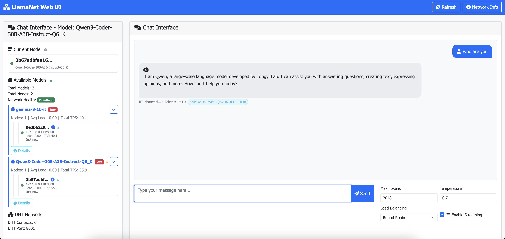

# LlamaNet: Decentralized Inference Swarm for llama.cpp

LlamaNet is a decentralized inference swarm for LLM models using llama.cpp. It uses Kademlia DHT for truly distributed node discovery without any central registry and supports both real-time streaming and traditional inference modes.



## Features

- **Hardware-based node identity** - Nodes maintain consistent IDs across restarts based on hardware fingerprinting
- **Decentralized DHT-based node discovery** using Kademlia protocol
- **High-performance inference** powered by [llama.cpp](https://github.com/ggerganov/llama.cpp)
- **Real-time streaming inference** with Server-Sent Events (SSE)
- **OpenAI-compatible API** with streaming support
- **Interactive web interface** with live streaming responses
- **Async Client Library** for easy integration with async/await support
- **Automatic node selection** based on load and performance
- **No single point of failure** - fully distributed architecture
- **Docker support** for easy deployment

## New Streaming Features

### Real-time Text Generation
- **Live streaming responses** - see text appear as it's generated
- **OpenAI-compatible streaming** - works with existing OpenAI clients
- **Web UI streaming** - interactive chat interface with real-time updates
- **Functional programming approach** - event-driven architecture with no blocking loops

### Streaming Endpoints
- **OpenAI Compatible**: `/v1/chat/completions` and `/v1/completions` with `stream: true`
- **Web Interface**: Toggle streaming on/off in the browser UI

## Hardware-Based Node Identity

### Consistent Node IDs
- **Hardware Fingerprinting**: Node IDs are generated based on CPU, memory, MAC addresses, and system identifiers
- **Persistent Identity**: Nodes maintain the same ID across restarts and reboots
- **Duplicate Prevention**: Eliminates duplicate node registrations in the DHT network
- **Multi-Node Support**: Multiple nodes on the same hardware get unique IDs based on port numbers

### Hardware Fingerprint Components
- **CPU Information**: Core count and architecture
- **Memory Configuration**: Total RAM size
- **Network Interfaces**: MAC addresses from physical interfaces
- **System Identifiers**: Platform UUID and hostname
- **Port Differentiation**: Allows multiple nodes per machine

### Node ID Validation
- **Consistency Checks**: Validates node ID matches current hardware on startup
- **Hardware Change Detection**: Automatically updates node ID when hardware changes
- **Fallback Mechanisms**: Uses legacy random IDs if hardware fingerprinting fails
- **Debug Endpoints**: `/hardware` and `/debug/node-id` for troubleshooting

## Requirements

- Python 3.8+
- **LLM models in GGUF format** (compatible with [llama.cpp](https://github.com/ggerganov/llama.cpp))
- Docker (optional, for containerized deployment)


## Use Cases & Scenarios

LlamaNet's decentralized architecture makes it ideal for various scenarios where traditional centralized AI services fall short. Here are key use cases where LlamaNet provides significant advantages:

### 🏢 Enterprise & Corporate Environments

#### **Scenario: Multi-Office AI Infrastructure**
A global company with offices in New York, London, Tokyo, and São Paulo wants to provide AI assistance to employees while maintaining data sovereignty and reducing latency.

**LlamaNet Solution:**
- Deploy inference nodes in each office location
- Employees automatically connect to the nearest/fastest node
- No data leaves regional boundaries (GDPR/compliance friendly)
- Automatic failover if one office's node goes down
- Cost-effective scaling without vendor lock-in

```bash
# New York Office
python -m inference_node.server --model-path ./models/company-model.gguf --port 8000

# London Office  
python -m inference_node.server --model-path ./models/company-model.gguf --port 8000 --bootstrap-nodes ny-office.company.com:8001

# Employees use OpenAI-compatible endpoint
openai.api_base = "http://local-llamanet.company.com/v1"
```

#### **Scenario: Hybrid Cloud-Edge Deployment**
A manufacturing company needs AI for both cloud analytics and edge device monitoring, with seamless integration between environments.

**LlamaNet Solution:**
- Cloud nodes for heavy analytics workloads
- Edge nodes for real-time device monitoring
- Automatic load balancing based on request type
- Unified API across all environments

### 🎓 Research & Academic Institutions

#### **Scenario: University Research Cluster**
A university research department wants to share AI resources across multiple labs while allowing each lab to contribute their own compute resources.

**LlamaNet Solution:**
- Each lab contributes nodes with their available hardware
- Researchers access a unified AI service regardless of which lab's hardware is used
- Fair resource sharing with automatic load balancing
- Easy addition of new labs/nodes without central coordination

```python
# Research Lab A contributes GPU node
python -m inference_node.server --model-path ./models/research-model.gguf --n-gpu-layers 35

# Research Lab B contributes CPU node
python -m inference_node.server --model-path ./models/research-model.gguf --bootstrap-nodes lab-a.university.edu:8001

# Researchers use unified client
client = Client(bootstrap_nodes="lab-a.university.edu:8001,lab-b.university.edu:8001")
```

### 🌐 Community & Open Source Projects

#### **Scenario: Community-Driven AI Network**
An open-source community wants to create a shared AI inference network where members contribute compute resources and everyone benefits.

**LlamaNet Solution:**
- Community members run nodes with their spare compute
- Automatic discovery and load balancing
- No central authority or single point of failure
- Contributors can prioritize their own requests

#### **Scenario: Regional AI Cooperatives**
Local businesses in a region want to share AI infrastructure costs while maintaining independence.

**LlamaNet Solution:**
- Each business runs nodes during their off-hours
- Shared access to AI capabilities without individual infrastructure costs
- Data stays within the cooperative network
- Easy scaling as more businesses join

### 🏥 Healthcare & Regulated Industries

#### **Scenario: Hospital Network AI**
A hospital network needs AI for medical imaging analysis while ensuring patient data never leaves their secure network.

**LlamaNet Solution:**
- Deploy nodes within each hospital's secure network
- AI processing happens locally with no external data transfer
- Automatic failover between hospitals in the network
- Compliance with HIPAA and other healthcare regulations

```bash
# Hospital A - Primary node
python -m inference_node.server --model-path ./models/medical-imaging.gguf

# Hospital B - Backup node
python -m inference_node.server --model-path ./models/medical-imaging.gguf --bootstrap-nodes hospital-a.network:8001

# Medical staff use secure internal endpoint
curl -X POST http://internal-ai.hospital.network/v1/chat/completions \
  -d '{"messages": [{"role": "user", "content": "Analyze this X-ray image"}]}'
```

### 🚀 Startups & Small Businesses

#### **Scenario: Cost-Effective AI for Startups**
A startup needs AI capabilities but cannot afford expensive cloud AI services or dedicated infrastructure.

**LlamaNet Solution:**
- Start with a single node on existing hardware
- Scale by adding nodes as the business grows
- No vendor lock-in or expensive API costs
- OpenAI-compatible API for easy integration with existing tools

#### **Scenario: Development Team Collaboration**
A distributed development team needs shared AI assistance for coding, documentation, and brainstorming.

**LlamaNet Solution:**
- Team members contribute nodes from their development machines
- Shared AI assistant available to all team members
- No external dependencies or API costs
- Works offline or in restricted network environments

### 🌍 Geographic & Network Constraints

#### **Scenario: Remote Locations with Limited Internet**
Research stations, ships, or remote facilities need AI capabilities but have limited or unreliable internet connectivity.

**LlamaNet Solution:**
- Local nodes provide AI services without internet dependency
- Mesh network topology for redundancy
- Automatic synchronization when connectivity is available
- Works in completely offline environments

#### **Scenario: Countries with AI Service Restrictions**
Organizations in regions where major AI services are blocked or restricted need local AI capabilities.

**LlamaNet Solution:**
- Completely self-hosted with no external dependencies
- Local language models and cultural customization
- No data sent to foreign servers
- Full control over AI capabilities and policies

### 🔬 Specialized Applications

#### **Scenario: Scientific Computing Clusters**
Research institutions need AI integrated with their existing HPC clusters for scientific workloads.

**LlamaNet Solution:**
- Deploy nodes on HPC cluster nodes during idle time
- Integrate with existing job schedulers
- Specialized models for scientific domains
- Seamless scaling with cluster resources

#### **Scenario: Gaming & Entertainment**
Game developers want to provide AI-powered NPCs and content generation without relying on external services.

**LlamaNet Solution:**
- Deploy nodes in game server infrastructure
- Low-latency AI for real-time game interactions
- No external API dependencies or costs
- Custom models trained on game-specific content

## Installation

### From Source

1. Clone the repository:
   ```bash
   git clone https://github.com/machaao/llama-net.git
   cd llama-net
   ```

2. Install the requirements:
   ```bash
   pip3 install -r requirements.txt
   ```
   
## Quick Start

### 1. Start a Bootstrap Node

```bash
python -m inference_node.server --model-path ./models/your-model.gguf
```

This starts:
- **HTTP API** on port 8000 (inference endpoints)
- **DHT node** on port 8001 (peer discovery)
- **Web UI** at http://localhost:8000
- **Hardware-based node ID** automatically generated and stored

### 2. Start Additional Nodes

```bash
python -m inference_node.server \
  --model-path ./models/your-model.gguf \
  --port 8002 \
  --dht-port 8003 \
  --bootstrap-nodes localhost:8001
```

**Note**: Each additional node will automatically generate a unique hardware-based node ID that includes the port number, ensuring no conflicts when running multiple nodes on the same machine.

### 3. Use the Web Interface

Open http://localhost:8000 in your browser for an interactive chat interface with:
- **Real-time streaming responses**
- **Network status monitoring**
- **Streaming toggle** for instant vs. complete responses
- **Hardware fingerprint information** in node details


## Hardware-Based Node Identity

### Automatic Node ID Generation

LlamaNet automatically generates consistent node IDs based on your hardware:

```bash
# First run - generates and stores hardware-based node ID
python -m inference_node.server --model-path ./models/model.gguf
# Output: Generated hardware-based node ID: 5f3d6263b7009e54... from 6 hardware components

# Subsequent runs - uses the same stored node ID
python -m inference_node.server --model-path ./models/model.gguf  
# Output: Using consistent stored hardware-based node ID: 5f3d6263b7009e54...
```

### Manual Node ID Override

You can still specify custom node IDs if needed:

```bash
# Override with custom node ID
python -m inference_node.server \
  --model-path ./models/model.gguf \
  --node-id my-custom-node-id-12345678901234567890

# Or via environment variable
export NODE_ID=my-custom-node-id-12345678901234567890
python -m inference_node.server --model-path ./models/model.gguf
```

### Hardware Change Handling

When hardware changes are detected:

```bash
# Hardware change detected - automatic update
# Output: Hardware fingerprint changed, generating new node ID
# Output: Updated stored node ID to: a1b2c3d4e5f6789a...
```

### Multiple Nodes on Same Hardware

Run multiple nodes on the same machine with automatic port-based differentiation:

```bash
# Node 1 - gets hardware-based ID with port 8000
python -m inference_node.server --model-path ./models/model.gguf --port 8000

# Node 2 - gets different hardware-based ID with port 8002  
python -m inference_node.server --model-path ./models/model.gguf --port 8002 --dht-port 8003 --bootstrap-nodes localhost:8001

# Node 3 - gets another unique hardware-based ID with port 8004
python -m inference_node.server --model-path ./models/model.gguf --port 8004 --dht-port 8005 --bootstrap-nodes localhost:8001
```

Each node gets a unique ID like:
- Node 1: `5f3d6263b7009e54...` (hardware + port:8000)
- Node 2: `7a948cc229cb9c9d...` (hardware + port:8002)  
- Node 3: `b8e1f4a5c6d7e8f9...` (hardware + port:8004)

## Hardware Debugging and Monitoring

### Check Hardware Fingerprint

```bash
# View hardware fingerprint details
curl http://localhost:8000/hardware

# Validate hardware consistency
curl http://localhost:8000/hardware/validate

# Debug node ID across all components
curl http://localhost:8000/debug/node-id
```

### Hardware Fingerprint Information

The hardware fingerprint includes:

```json
{
  "mac_count": 2,
  "has_system_uuid": true,
  "cpu_count": 8,
  "memory_gb": 16,
  "platform": "Linux-5.15.0-91-generic-x86_64-with-glibc2.35",
  "hostname": "my-server",
  "is_fallback": false
}
```

### Node ID Storage

Hardware-based node IDs are automatically stored in:
- **Linux/macOS**: `~/.llamanet_node_id`
- **Windows**: `%USERPROFILE%\.llamanet_node_id`

This ensures the same node ID is used across restarts.

## Model Setup

### Model Requirements

LlamaNet requires models in **GGUF format** (GGML Universal Format). GGUF is the modern format used by llama.cpp for efficient inference.

### Download Sources

#### 1. Hugging Face Hub
The largest collection of GGUF models is available on Hugging Face:

**Current Active Publishers**
- [bartowski](https://huggingface.co/bartowski) - Most active, high-quality quantizations (DeepSeek-R1, Llama 3.1/3.2, Qwen 2.5/3)
- [unsloth](https://huggingface.co/unsloth) - Extremely popular, performance-optimized models (Qwen3, GPT-OSS series)
- [MaziyarPanahi](https://huggingface.co/MaziyarPanahi) - Very active with comprehensive coverage (Gemma 3, Llama, Qwen)
- [mradermacher](https://huggingface.co/mradermacher) - Comprehensive model coverage with excellent documentation
- [DavidAU](https://huggingface.co/DavidAU) - Specialized in abliterated/uncensored variants
- [Microsoft](https://huggingface.co/microsoft) - Official Microsoft models (Phi-3.5, etc.)
- [Meta](https://huggingface.co/meta-llama) - Official Meta Llama models
- [Google](https://huggingface.co/google) - Official Gemma models
- [Mistral AI](https://huggingface.co/mistralai) - Official Mistral models
- [Qwen](https://huggingface.co/Qwen) - Official Qwen models from Alibaba

#### 2. Direct Downloads
Some models are available for direct download from official sources.

### Download Methods

#### Method 1: Using Hugging Face CLI (Recommended)

```bash
# Install Hugging Face CLI
pip install huggingface_hub

# Download latest Llama 3.1 8B model (recommended)
huggingface-cli download bartowski/Meta-Llama-3.1-8B-Instruct-GGUF Meta-Llama-3.1-8B-Instruct-Q4_K_M.gguf --local-dir ./models --local-dir-use-symlinks False

# Download Qwen 2.5 7B (excellent performance)
huggingface-cli download bartowski/Qwen2.5-7B-Instruct-GGUF Qwen2.5-7B-Instruct-Q4_K_M.gguf --local-dir ./models --local-dir-use-symlinks False

# Download multiple quantizations of a model
huggingface-cli download bartowski/Meta-Llama-3.1-8B-Instruct-GGUF --include="*.gguf" --local-dir ./models/llama-3.1-8b
```

#### Method 2: Using wget/curl

```bash
# Create models directory
mkdir -p models

# Download Llama 3.1 8B directly
wget -O models/Meta-Llama-3.1-8B-Instruct-Q4_K_M.gguf \
  "https://huggingface.co/bartowski/Meta-Llama-3.1-8B-Instruct-GGUF/resolve/main/Meta-Llama-3.1-8B-Instruct-Q4_K_M.gguf"

# Download Qwen 2.5 7B using curl
curl -L -o models/Qwen2.5-7B-Instruct-Q4_K_M.gguf \
  "https://huggingface.co/bartowski/Qwen2.5-7B-Instruct-GGUF/resolve/main/Qwen2.5-7B-Instruct-Q4_K_M.gguf"
```

#### Method 3: Using Git LFS

```bash
# Clone entire model repository
git clone https://huggingface.co/bartowski/Meta-Llama-3.1-8B-Instruct-GGUF models/llama-3.1-8b

# Clone specific files only
GIT_LFS_SKIP_SMUDGE=1 git clone https://huggingface.co/bartowski/Meta-Llama-3.1-8B-Instruct-GGUF models/llama-3.1-8b
cd models/llama-3.1-8b
git lfs pull --include="*.Q4_K_M.gguf"
```

### Recommended Models by Use Case

#### 🚀 Getting Started (Small & Fast)
```bash
# Llama 3.2 3B (3B parameters) - Latest Meta model, excellent for testing
huggingface-cli download bartowski/Llama-3.2-3B-Instruct-GGUF Llama-3.2-3B-Instruct-Q4_K_M.gguf --local-dir ./models

# Gemma 3 4B (4B parameters) - Latest Google model, great performance
huggingface-cli download MaziyarPanahi/gemma-3-4b-it-GGUF gemma-3-4b-it-Q4_K_M.gguf --local-dir ./models

# Phi-3.5 Mini (3.8B parameters) - Latest Microsoft model, great for testing
huggingface-cli download bartowski/Phi-3.5-mini-instruct-GGUF Phi-3.5-mini-instruct-Q4_K_M.gguf --local-dir ./models
```

#### 💼 Production Use (Balanced Performance) - **RECOMMENDED**
```bash
# Llama 3.1 8B Instruct - Latest Meta model, excellent general purpose (RECOMMENDED)
huggingface-cli download bartowski/Meta-Llama-3.1-8B-Instruct-GGUF Meta-Llama-3.1-8B-Instruct-Q4_K_M.gguf --local-dir ./models

# Qwen3 7B Instruct - Latest Qwen model, outstanding performance
huggingface-cli download unsloth/Qwen3-7B-Instruct-GGUF Qwen3-7B-Instruct-Q4_K_M.gguf --local-dir ./models

# DeepSeek-R1 Distill 7B - Latest breakthrough model, excellent reasoning
huggingface-cli download bartowski/DeepSeek-R1-Distill-Qwen-7B-GGUF DeepSeek-R1-Distill-Qwen-7B-Q4_K_M.gguf --local-dir ./models

# Mistral 7B v0.3 - Latest Mistral model, high quality
huggingface-cli download bartowski/Mistral-7B-Instruct-v0.3-GGUF Mistral-7B-Instruct-v0.3-Q4_K_M.gguf --local-dir ./models

# CodeQwen 1.5 7B - Specialized for coding tasks
huggingface-cli download bartowski/CodeQwen1.5-7B-Chat-GGUF CodeQwen1.5-7B-Chat-Q4_K_M.gguf --local-dir ./models
```

#### 🎯 High Performance (Larger Models)
```bash
# Qwen3 30B Instruct - Most popular large model, exceptional performance
huggingface-cli download unsloth/Qwen3-30B-A3B-GGUF Qwen3-30B-A3B-Q4_K_M.gguf --local-dir ./models

# DeepSeek-R1 Distill 32B - Latest breakthrough model, top reasoning
huggingface-cli download bartowski/DeepSeek-R1-Distill-Qwen-32B-abliterated-GGUF DeepSeek-R1-Distill-Qwen-32B-abliterated-Q4_K_M.gguf --local-dir ./models

# Llama 3.1 70B Instruct - Top-tier reasoning and knowledge
huggingface-cli download bartowski/Meta-Llama-3.1-70B-Instruct-GGUF Meta-Llama-3.1-70B-Instruct-Q4_K_M.gguf --local-dir ./models

# GPT-OSS 20B - Popular open-source alternative
huggingface-cli download unsloth/gpt-oss-20b-GGUF gpt-oss-20b-Q4_K_M.gguf --local-dir ./models
```

#### 🧠 Maximum Capability (Frontier Models)
```bash
# Llama 3.1 405B Instruct - Frontier model capability (requires massive resources)
huggingface-cli download bartowski/Meta-Llama-3.1-405B-Instruct-GGUF Meta-Llama-3.1-405B-Instruct-Q4_K_M.gguf --local-dir ./models

# Qwen3 72B Instruct - Latest large Qwen model, exceptional capability
huggingface-cli download unsloth/Qwen3-72B-Instruct-GGUF Qwen3-72B-Instruct-Q4_K_M.gguf --local-dir ./models

# DeepSeek-R1 Distill 70B - Largest breakthrough model variant
huggingface-cli download bartowski/DeepSeek-R1-Distill-Qwen-70B-GGUF DeepSeek-R1-Distill-Qwen-70B-Q4_K_M.gguf --local-dir ./models

# Qwen 2.5 72B Instruct - Proven high performance for complex tasks
huggingface-cli download bartowski/Qwen2.5-72B-Instruct-GGUF Qwen2.5-72B-Instruct-Q4_K_M.gguf --local-dir ./models
```

### Understanding Quantization Levels

GGUF models come in different quantization levels that trade off quality vs. size/speed:

| Quantization | Quality | Size | Speed | Use Case |
|--------------|---------|------|-------|----------|
| **Q2_K** | Lower | Smallest | Fastest | Testing, very limited resources |
| **Q3_K_M** | Good | Small | Fast | Mobile, edge devices |
| **Q4_K_M** | **Recommended** | Medium | Balanced | **Most use cases** |
| **Q5_K_M** | High | Large | Slower | Quality-focused applications |
| **Q6_K** | Very High | Larger | Slower | Maximum quality needs |
| **Q8_0** | Highest | Largest | Slowest | Research, benchmarking |

**Recommendation**: Start with **Q4_K_M** quantization for the best balance of quality, size, and speed.

### Model Directory Structure

Organize your models for easy management:

```
models/
├── llama-3.1-8b/
│   ├── Meta-Llama-3.1-8B-Instruct-Q4_K_M.gguf
│   ├── Meta-Llama-3.1-8B-Instruct-Q5_K_M.gguf
│   └── README.md
├── qwen-2.5-7b/
│   ├── Qwen2.5-7B-Instruct-Q4_K_M.gguf
│   └── README.md
├── phi-3.5-mini/
│   ├── Phi-3.5-mini-instruct-Q4_K_M.gguf
│   └── README.md
└── codeqwen-1.5-7b/
    ├── CodeQwen1.5-7B-Chat-Q4_K_M.gguf
    └── README.md
```

### Hardware Requirements by Model Size

| Model Size | RAM Required | VRAM (GPU) | CPU Cores | Use Case |
|------------|--------------|------------|-----------|----------|
| **1B-3B** | 4-8 GB | 2-4 GB | 2+ | Testing, development |
| **7B-8B** | 8-16 GB | 6-10 GB | 4+ | **General purpose (RECOMMENDED)** |
| **14B-15B** | 16-32 GB | 12-20 GB | 8+ | High quality responses |
| **32B-34B** | 32-64 GB | 24-40 GB | 16+ | Professional use |
| **70B-72B** | 64-128 GB | 48-80 GB | 32+ | Maximum capability |
| **405B** | 256+ GB | 200+ GB | 64+ | Frontier model research |

### Quick Start with Downloaded Model

Once you have a model downloaded:

```bash
# Start LlamaNet with Llama 3.1 8B (recommended)
python -m inference_node.server --model-path ./models/Meta-Llama-3.1-8B-Instruct-Q4_K_M.gguf

# Or with environment variable
export MODEL_PATH=./models/Qwen2.5-7B-Instruct-Q4_K_M.gguf
python -m inference_node.server
```

### Troubleshooting Model Issues

**Model not loading:**
```bash
# Check if file exists and is readable
ls -la ./models/your-model.gguf

# Verify it's a valid GGUF file
file ./models/your-model.gguf
```

**Out of memory errors:**
```bash
# Try a smaller quantization
# Q4_K_M → Q3_K_M → Q2_K

# Or reduce context size
python -m inference_node.server --model-path ./model.gguf --n-ctx 1024
```

**Slow inference:**
```bash
# Enable GPU acceleration (if available)
python -m inference_node.server --model-path ./model.gguf --n-gpu-layers 35

# Increase batch size for throughput
python -m inference_node.server --model-path ./model.gguf --n-batch 512
```

## API Usage

### OpenAI-Compatible API

#### Using OpenAI Python Library
```python
import openai

# Configure to use LlamaNet
openai.api_base = "http://localhost:8000/v1"
openai.api_key = "dummy-key"  # Not used but required

# Streaming chat completion
response = openai.ChatCompletion.create(
    model="llamanet",
    messages=[{"role": "user", "content": "Hello!"}],
    stream=True
)

for chunk in response:
    if chunk.choices[0].delta.get("content"):
        print(chunk.choices[0].delta.content, end="", flush=True)
```

#### Direct HTTP Streaming
```python
import requests
import json

response = requests.post("http://localhost:8000/v1/chat/completions",
    json={
        "model": "llamanet",
        "messages": [{"role": "user", "content": "Explain machine learning"}],
        "stream": True,
        "max_tokens": 150
    },
    stream=True
)

for line in response.iter_lines():
    if line.startswith(b'data: '):
        data_str = line[6:].decode()
        if data_str.strip() == '[DONE]':
            break
        
        data = json.loads(data_str)
        if data["choices"][0]["delta"].get("content"):
            print(data["choices"][0]["delta"]["content"], end="", flush=True)
```

### Python Client Library

#### Async Client with Discovery
```python
import asyncio
from client.api import Client

async def main():
    client = Client(bootstrap_nodes="localhost:8001")
    
    try:
        # Discover available nodes
        nodes = await client.dht_discovery.get_nodes()
        print(f"Found {len(nodes)} nodes")
        
        # Generate text
        response = await client.generate(
            prompt="What is LlamaNet?",
            max_tokens=150,
            temperature=0.7
        )
        
        if response:
            print(f"Response: {response.text}")
            print(f"Node: {response.node_id}")
            print(f"Tokens: {response.tokens_generated}")
    finally:
        await client.close()

asyncio.run(main())
```

## Web UI Features

The built-in web interface (http://localhost:8000) provides:

### Chat Interface
- **Real-time streaming** - watch responses appear live
- **Parameter controls** - adjust max tokens, temperature
- **Streaming toggle** - enable/disable real-time responses

### Network Monitoring
- **Live node discovery** - see all connected nodes
- **Performance metrics** - load, tokens/second, uptime
- **Health status** - monitor node availability
- **DHT network status** - peer connections and routing table

### Configuration Options
- **Max Tokens**: Control response length (1-2048)
- **Temperature**: Adjust creativity (0.0-2.0)
- **Streaming Mode**: Toggle real-time vs. complete responses

## Docker Deployment

LlamaNet provides comprehensive Docker support with automatic GPU/CPU detection, multi-node orchestration, and production-ready configurations.

### Quick Start with Docker

#### Prerequisites
- Docker and Docker Compose installed
- NVIDIA Container Toolkit (for GPU support, optional)
- GGUF model file in `./models/` directory

#### Single Command Deployment
```bash
# Clone and start a 3-node network
git clone https://github.com/machaao/llama-net.git
cd llama-net
mkdir -p models
# Place your GGUF model in models/model.gguf
docker-compose -f docker/docker-compose.yml up -d
```

#### Access Points
- **Web UI**: http://localhost:8000
- **API**: http://localhost:8000/v1/chat/completions
- **Additional Nodes**: http://localhost:8002, http://localhost:8004

### Docker Features

#### 🔧 **Automatic Hardware Detection**
- **GPU Auto-Detection**: Automatically detects NVIDIA GPUs and installs CUDA support
- **CPU Fallback**: Falls back to optimized CPU mode if no GPU available
- **Smart Configuration**: Optimizes settings based on detected hardware

#### 🚀 **Multi-Node Orchestration**
```bash
# Start the complete network
docker-compose -f docker/docker-compose.yml up -d

# Scale to more nodes
docker-compose -f docker/docker-compose.yml up -d --scale inference1=3

# Monitor all nodes
docker-compose -f docker/docker-compose.yml logs -f
```

#### 🎯 **Production Ready**
- Health checks and monitoring
- Automatic restarts and failover
- Resource optimization
- Security best practices

### Manual Docker Deployment

#### GPU-Enabled Node
```bash
# Bootstrap node with GPU support
docker run -d \
  --name llamanet-gpu \
  --gpus all \
  -p 8000:8000 \
  -p 8001:8001/udp \
  -v $(pwd)/models:/models:ro \
  -e MODEL_PATH=/models/your-model.gguf \
  -e HARDWARE_MODE=auto \
  llamanet/inference:latest
```

#### CPU-Only Node
```bash
# Additional CPU node
docker run -d \
  --name llamanet-cpu \
  -p 8002:8000 \
  -p 8003:8001/udp \
  -v $(pwd)/models:/models:ro \
  -e MODEL_PATH=/models/your-model.gguf \
  -e HARDWARE_MODE=cpu \
  -e BOOTSTRAP_NODES=localhost:8001 \
  llamanet/inference:latest
```

### Environment Configuration

| Variable | Default | Description |
|----------|---------|-------------|
| `MODEL_PATH` | *required* | Path to GGUF model file |
| `HARDWARE_MODE` | `auto` | `auto`, `gpu`, or `cpu` |
| `N_GPU_LAYERS` | `auto` | GPU layers (auto-optimized) |
| `BOOTSTRAP_NODES` | `""` | Comma-separated bootstrap nodes |
| `PORT` | `8000` | HTTP API port |
| `DHT_PORT` | `8001` | DHT protocol port |

### Docker API Endpoints

All standard OpenAI endpoints plus LlamaNet extensions:

```bash
# Health check
curl http://localhost:8000/health

# List network models
curl http://localhost:8000/v1/models/network

# Chat completion with load balancing
curl -X POST http://localhost:8000/v1/chat/completions \
  -H "Content-Type: application/json" \
  -d '{
    "model": "llamanet",
    "messages": [{"role": "user", "content": "Hello!"}],
    "strategy": "load_balanced"
  }'
```

### Monitoring and Debugging

```bash
# View all container logs
docker-compose -f docker/docker-compose.yml logs -f

# Check network status
curl http://localhost:8000/dht/status

# Monitor resources
docker stats

# Debug hardware detection
docker logs llamanet-gpu | grep -E "(GPU|Hardware)"
```

### Advanced Docker Usage

For detailed Docker documentation including:
- **Hardware optimization strategies**
- **Production deployment patterns**
- **Scaling and load balancing**
- **Troubleshooting guides**
- **Security configurations**
- **Performance tuning**

See the comprehensive **[Docker Documentation](docker/README.md)** 📖

## Network Monitoring

### Command Line Tools

```bash
# Show network status
python -m tools.network_status localhost:8001

# Monitor network in real-time
python -m tools.monitor localhost:8001

# Quick health check
python -m tools.quick_check
```

### Web Dashboard

Visit http://localhost:8000 for:
- **Real-time network status**
- **Node performance metrics**
- **Interactive chat interface**
- **Streaming response testing**

## API Endpoints

### LlamaNet Native
- `GET /status` - Node metrics
- `GET /info` - Node information
- `GET /health` - Health check
- `GET /dht/status` - DHT network status

### OpenAI Compatible
- `GET /v1/models` - List models
- `POST /v1/completions` - Text completion (**streaming supported**)
- `POST /v1/chat/completions` - Chat completion (**streaming supported**)

### Web Interface
- `GET /` - Web UI dashboard
- `GET /static/*` - Static assets

## Configuration

### Environment Variables
```bash
MODEL_PATH=/path/to/model.gguf    # Required: Path to GGUF model
HOST=0.0.0.0                      # Bind address
PORT=8000                         # HTTP API port
DHT_PORT=8001                     # DHT protocol port
NODE_ID=unique-node-id            # Node identifier
BOOTSTRAP_NODES=ip:port,ip:port   # Bootstrap nodes
HEARTBEAT_INTERVAL=10             # DHT publish interval
N_CTX=2048                        # Context size
N_BATCH=8                         # Batch size
N_GPU_LAYERS=0                    # GPU layers (0 = CPU only)
```

### Command Line Options
```bash
python -m inference_node.server \
  --model-path ./models/model.gguf \
  --host 0.0.0.0 \
  --port 8000 \
  --dht-port 8001 \
  --node-id my-node \
  --bootstrap-nodes localhost:8001
```

## Architecture

### Streaming Architecture
- **Server-Sent Events (SSE)** for real-time communication
- **Functional programming** approach with async generators
- **Event-driven UI** with real-time DOM updates
- **Non-blocking streaming** using async/await patterns

### DHT Network
- **Kademlia protocol** for distributed hash table
- **Automatic node discovery** without central registry
- **Load balancing** based on node performance
- **Fault tolerance** with automatic failover

### OpenAI Compatibility
- **Drop-in replacement** for OpenAI API
- **Streaming support** with identical format
- **Chat and completion** endpoints
- **Compatible with existing tools** (curl, Postman, OpenAI libraries)

## Performance

### Streaming Benefits
- **Immediate feedback** - users see responses instantly
- **Better UX** - no waiting for complete generation
- **Lower perceived latency** - streaming feels faster
- **Cancellable requests** - stop generation early

### Network Efficiency
- **Distributed load** across multiple nodes
- **Automatic scaling** as nodes join/leave
- **Smart routing** to least loaded nodes
- **Fault tolerance** with automatic retry

## Streaming Implementation Details

### Frontend Streaming
The web UI uses a custom `StreamUI` class that:
- Handles Server-Sent Events from both LlamaNet and OpenAI endpoints
- Updates the chat interface in real-time
- Manages streaming state and error handling
- Provides visual feedback with animated cursors

### Backend Streaming
The server implements streaming via:
- **Async generators** for token-by-token generation
- **FastAPI StreamingResponse** for HTTP streaming
- **OpenAI-compatible format** for existing client compatibility
- **Functional programming patterns** avoiding blocking loops

### 💡 Development & Testing

#### **Scenario: AI Application Development**
Developers building AI-powered applications need reliable, cost-effective inference for development and testing.

**LlamaNet Solution:**
- Local development environment with OpenAI-compatible API
- No API rate limits or costs during development
- Easy transition from development to production
- Test with different models and configurations

```python
# Development setup
python -m inference_node.server --model-path ./models/dev-model.gguf

# Application code (works with both LlamaNet and OpenAI)
import openai
openai.api_base = "http://localhost:8000/v1"  # LlamaNet for dev
# openai.api_base = "https://api.openai.com/v1"  # OpenAI for production
```

### 🔒 Privacy & Security Focused

#### **Scenario: Sensitive Data Processing**
Organizations handling sensitive data (legal, financial, personal) need AI capabilities without exposing data to third parties.

**LlamaNet Solution:**
- All processing happens within organization's infrastructure
- No data sent to external AI services
- Full audit trail and control over AI operations
- Compliance with data protection regulations

#### **Scenario: Competitive Intelligence**
Companies need AI assistance for strategic planning without revealing sensitive information to competitors or AI service providers.

**LlamaNet Solution:**
- Private AI network within company infrastructure
- Custom models trained on proprietary data
- No external data leakage or vendor dependencies
- Complete control over AI capabilities and access

## Benefits Summary

| Scenario Type | Key Benefits |
|---------------|--------------|
| **Enterprise** | Cost reduction, data sovereignty, compliance, scalability |
| **Research** | Resource sharing, collaboration, specialized models |
| **Community** | Shared costs, democratic access, no central authority |
| **Healthcare** | Privacy compliance, local processing, secure networks |
| **Startups** | Low cost, no vendor lock-in, gradual scaling |
| **Remote/Restricted** | Offline capability, no external dependencies |
| **Development** | No API costs, unlimited testing, easy deployment |
| **Privacy-Focused** | Data control, compliance, competitive advantage |

## Getting Started for Your Use Case

1. **Identify Your Scenario**: Match your needs to the scenarios above
2. **Plan Your Network**: Decide on node locations and bootstrap strategy
3. **Choose Your Model**: Select appropriate GGUF models for your use case
4. **Deploy Incrementally**: Start with one node, add more as needed
5. **Integrate Applications**: Use OpenAI-compatible API for easy integration

LlamaNet's flexibility allows it to adapt to virtually any scenario where distributed, private, or cost-effective AI inference is needed.

## System Architecture Diagrams

### 1. Network Formation Flow

```
                    LlamaNet Network Formation
                           
    Step 1: Bootstrap Node Starts
    ┌─────────────────┐
    │  Bootstrap Node │ ──► Starts DHT Network
    │    (Node A)     │     Creates initial routing table
    └─────────────────┘
            │
            ▼
    ┌─────────────────┐
    │   DHT Network   │
    │   Storage Keys: │
    │ • model:llama   │
    │ • node:abc123   │
    │ • all_nodes     │
    └─────────────────┘
            │
            ▼
    Step 2: Additional Nodes Join
    
    Node B ──► Connects to Bootstrap ──► Joins DHT
    Node C ──► Connects to Bootstrap ──► Joins DHT
    Node D ──► Connects to Node B    ──► Joins DHT
```

### 2. Node Discovery Process

```
Client Discovery Sequence:

1. Client Query:
   Client ──► DHT Network: "Find model:llama-7b"

2. DHT Response:
   DHT Network ──► Client: [Node1, Node2, Node3]

3. Health Checks:
   Client ──► Node1: /status ──► Response: Load=0.3, TPS=15.2
   Client ──► Node2: /status ──► Response: Load=0.7, TPS=12.1  
   Client ──► Node3: /status ──► Response: Load=0.1, TPS=18.5

4. Node Selection:
   Client selects Node3 (lowest load)

5. Inference Request:
   Client ──► Node3: /v1/chat/completions ──► Generated Text Response
```

### 3. DHT Key Distribution

```
DHT Storage Structure:

┌─────────────────────────────────────────────────────────────┐
│ Key: "model:llama-7b"                                       │
│ Value: [                                                    │
│   {node_id: "abc123", ip: "192.168.1.10", port: 8000},    │
│   {node_id: "def456", ip: "192.168.1.11", port: 8000},    │
│   {node_id: "ghi789", ip: "192.168.1.12", port: 8000}     │
│ ]                                                           │
└─────────────────────────────────────────────────────────────┘

┌─────────────────────────────────────────────────────────────┐
│ Key: "node:abc123"                                          │
│ Value: {                                                    │
│   node_id: "abc123", ip: "192.168.1.10", port: 8000,     │
│   model: "llama-7b", load: 0.3, tps: 15.2, uptime: 3600  │
│ }                                                           │
└─────────────────────────────────────────────────────────────┘

┌─────────────────────────────────────────────────────────────┐
│ Key: "all_nodes"                                            │
│ Value: [All active nodes regardless of model]              │
└─────────────────────────────────────────────────────────────┘
```

### 4. Client Request Flow

```
                    Client Request Processing Flow

    ┌─────────────┐
    │   Client    │
    │   Request   │
    └──────┬──────┘
           │
           ▼
    ┌─────────────┐
    │ Select API  │
    │    Mode     │ ──► OpenAI API (/v1/chat/completions)
    └──────┬──────┘ 
           │
           ▼
    ┌─────────────┐
    │ DHT Node    │
    │ Discovery   │ ──► Query: "model:llama" or "all_nodes"
    └──────┬──────┘
           │
           ▼
    ┌─────────────┐
    │ Node        │
    │ Selection   │ ──► Load Balancing (lowest load)
    └──────┬──────┘ ──► Health Check (/status)
           │
           ▼
    ┌─────────────┐
    │ HTTP        │
    │ Request     │ ──► POST /v1/chat/completions
    └──────┬──────┘
           │
           ▼
    ┌─────────────┐
    │ LLM         │
    │ Inference   │ ──► llama.cpp processing
    └──────┬──────┘
           │
           ▼
    ┌─────────────┐
    │ Response    │
    │ Formatting  │ ──► LlamaNet or OpenAI format
    └─────────────┘
```

### 5. Network Topology Example

```
                    LlamaNet Network Topology
                           
                    Internet/Local Network
                           │
        ┌──────────────────┼──────────────────┐
        │                  │                  │
   ┌────▼────┐        ┌────▼────┐        ┌────▼────┐
   │ Node A  │◄──────►│ Node B  │◄──────►│ Node C  │
   │ HTTP:   │   DHT  │ HTTP:   │   DHT  │ HTTP:   │
   │ :8000   │ Gossip │ :8002   │ Gossip │ :8004   │
   │ DHT:    │        │ DHT:    │        │ DHT:    │
   │ :8001   │        │ :8003   │        │ :8005   │
   └─────────┘        └─────────┘        └─────────┘
        ▲                  ▲                  ▲
        │ HTTP API         │ HTTP API         │ HTTP API
        │                  │                  │
   ┌────▼────┐        ┌────▼────┐        ┌────▼────┐
   │Client 1 │        │Client 2 │        │Web UI   │
   │Python   │        │OpenAI   │        │Browser  │
   │API      │        │Library  │        │         │
   └─────────┘        └─────────┘        └─────────┘

Legend:
━━━ HTTP API Connections (Inference)
◄─► DHT Protocol Connections (Discovery)
```

### 6. OpenAI API Compatibility Layer

```
                OpenAI Compatibility Architecture

    ┌─────────────────┐
    │   OpenAI        │
    │   Client        │ ──► Uses standard OpenAI library
    │   Application   │
    └─────────┬───────┘
              │
              ▼
    ┌─────────────────┐
    │ LlamaNet        │
    │ Compatibility   │ ──► /v1/models
    │ Endpoints       │ ──► /v1/completions  
    └─────────┬───────┘ ──► /v1/chat/completions
              │
              ▼
    ┌─────────────────┐
    │ Request         │
    │ Translation     │ ──► OpenAI format → LlamaNet format
    └─────────┬───────┘
              │
              ▼
    ┌─────────────────┐
    │ LlamaNet        │
    │ Core Engine     │ ──► DHT Discovery
    └─────────┬───────┘ ──► Node Selection
              │         ──► Load Balancing
              ▼
    ┌─────────────────┐
    │ llama.cpp       │
    │ Inference       │ ──► Model Processing
    └─────────┬───────┘ ──► Text Generation
              │
              ▼
    ┌─────────────────┐
    │ Response        │
    │ Translation     │ ──► LlamaNet format → OpenAI format
    └─────────────────┘
```

### 7. Web UI Architecture

```
                    Web UI Component Architecture

    ┌─────────────────┐
    │   Web Browser   │
    └─────────┬───────┘
              │ HTTP Request
              ▼
    ┌─────────────────┐
    │ Static Files    │
    │ Server          │ ──► Bootstrap CSS
    └─────────┬───────┘ ──► Font Awesome Icons
              │         ──► Custom CSS
              ▼         ──► JavaScript App
    ┌─────────────────┐
    │ JavaScript      │
    │ Application     │ ──► Network Monitor
    └─────────┬───────┘ ──► Chat Interface
              │         ──► API Mode Selector
              ▼
    ┌─────────────────┐
    │ Backend API     │
    │ Endpoints       │ ──► /dht/status (Network Info)
    └─────────┬───────┘ ──► /v1/chat/completions (OpenAI)
              │         
              ▼
    ┌─────────────────┐
    │ Response        │
    │ Processing      │ ──► Markdown Rendering
    └─────────┬───────┘ ──► Syntax Highlighting
              │         ──► Chat Display
              ▼
    ┌─────────────────┐
    │ User Interface  │
    │ Updates         │ ──► Real-time Chat
    └─────────────────┘ ──► Network Status
                        ──► Performance Metrics
```

### 8. Data Flow Summary

```
                    End-to-End Data Flow

┌─────────────┐    ┌─────────────┐    ┌─────────────┐    ┌─────────────┐
│   Client    │───►│ DHT Network │───►│ Node Select │───►│ Inference   │
│             │    │             │    │             │    │             │
│ • Web UI    │    │ • Discovery │    │ • Load Bal. │    │ • llama.cpp │
│ • API Call  │    │ • Routing   │    │ • Failover  │    │ • Generate  │
│ • OpenAI    │    │ • Storage   │    │ • Health    │    │ • Response  │
│ • Python    │    │ • Gossip    │    │ • Metrics   │    │ • Tokens    │
└─────────────┘    └─────────────┘    └─────────────┘    └─────────────┘
       ▲                                                         │
       │                    Response Flow                        │
       └─────────────────────────────────────────────────────────┘
                           
Request Types:
• Text Generation    • Chat Completion    • Model Listing
• Node Discovery     • Health Checks      • Status Updates
```

### 9. Component Interaction Flow

```
Node Startup Sequence:
┌─────────────────┐
│ 1. Load Config  │ ──► Parse CLI args & environment
└─────────┬───────┘
          ▼
┌─────────────────┐
│ 2. Init LLM     │ ──► Load GGUF model with llama.cpp
└─────────┬───────┘
          ▼
┌─────────────────┐
│ 3. Start DHT    │ ──► Create Kademlia node
└─────────┬───────┘
          ▼
┌─────────────────┐
│ 4. Join Network │ ──► Connect to bootstrap nodes
└─────────┬───────┘
          ▼
┌─────────────────┐
│ 5. HTTP Server  │ ──► Serve API & Web UI
└─────────┬───────┘
          ▼
┌─────────────────┐
│ 6. Publish Info │ ──► Announce to DHT every 10s
└─────────────────┘

Client Discovery Process:
┌─────────────────┐
│ 1. DHT Client   │ ──► Initialize Kademlia client
└─────────┬───────┘
          ▼
┌─────────────────┐
│ 2. Query Net    │ ──► Search by model or all nodes
└─────────┬───────┘
          ▼
┌─────────────────┐
│ 3. Health Check │ ──► Verify availability & performance
└─────────┬───────┘
          ▼
┌─────────────────┐
│ 4. Load Balance │ ──► Select optimal node
└─────────┬───────┘
          ▼
┌─────────────────┐
│ 5. Send Request │ ──► HTTP call to selected node
└─────────┬───────┘
          ▼
┌─────────────────┐
│ 6. Handle Resp  │ ──► Process result or failover
└─────────────────┘
```

### Network Formation

```
Bootstrap Node (8001) ← Node 1 (8003) ← Node 2 (8005)
       ↑                     ↑              ↑
   Client connects      Joins DHT      Joins DHT
```

### DHT Keys

- `model:{model_name}` - Find nodes serving specific models
- `node:{node_id}` - Find specific nodes by ID  
- `all_nodes` - Discover any available nodes

## Component Interaction Flow

### 1. Node Startup Sequence
1. **Load Configuration** - Parse CLI args and environment variables
2. **Initialize LLM** - Load GGUF model with llama.cpp
3. **Start DHT Node** - Create Kademlia node on available port
4. **Join Network** - Connect to bootstrap nodes if specified
5. **Start HTTP Server** - Serve inference API and web UI
6. **Begin Publishing** - Announce availability to DHT every 10 seconds

### 2. Client Discovery Process
1. **Create DHT Client** - Initialize Kademlia client
2. **Query Network** - Search for nodes by model or all nodes
3. **Health Check** - Verify node availability and performance
4. **Load Balancing** - Select optimal node based on load/TPS
5. **Send Request** - Make HTTP call to selected node
6. **Handle Response** - Process result or failover to backup node

### 3. Request Processing Pipeline
1. **Receive Request** - HTTP endpoint receives generation request
2. **Validate Input** - Check prompt, parameters, and format
3. **Queue Processing** - Add to inference queue if needed
4. **LLM Generation** - Call llama.cpp with specified parameters
5. **Format Response** - Convert to LlamaNet or OpenAI format
6. **Update Metrics** - Track tokens, timing, and load statistics
7. **Return Result** - Send formatted response to client

This architecture ensures **high availability**, **automatic scaling**, and **fault tolerance** while maintaining **compatibility** with existing OpenAI-based applications.

## Troubleshooting

### Common Issues

**No nodes discovered:**
```bash
# Check DHT status
curl http://localhost:8000/dht/status

# Verify bootstrap nodes
python -m tools.network_status localhost:8001
```

**Web UI not loading:**
```bash
# Check if static files are served
curl http://localhost:8000/static/style.css
```

**Streaming responses cut off:**
- Ensure your HTTP client supports streaming
- Check for proxy/firewall interference
- Verify Content-Type headers are correct

### Hardware Identity Issues
```bash
# Check hardware fingerprint
curl http://localhost:8000/hardware

# Validate node ID consistency
curl http://localhost:8000/hardware/validate

# Debug node ID mismatches
curl http://localhost:8000/debug/node-id

# Force hardware revalidation
curl -X POST http://localhost:8000/hardware/update

# Fix node ID mismatches (emergency)
curl -X POST http://localhost:8000/debug/fix-node-id
```

### Debug Mode
```bash
# Enable debug logging
export LOG_LEVEL=DEBUG
python -m inference_node.server --model-path ./model.gguf
```

## Use Cases & Scenarios

LlamaNet's decentralized architecture with streaming support makes it ideal for:

### 🏢 Enterprise & Corporate Environments
- **Real-time AI assistance** with immediate feedback
- **Multi-office deployment** with local streaming nodes
- **Compliance-friendly** - data never leaves your infrastructure

### 🎓 Research & Academic Institutions
- **Interactive research tools** with streaming responses
- **Collaborative AI** across multiple departments
- **Resource sharing** with real-time load balancing

### 🌐 Community & Open Source Projects
- **Community-driven AI** with shared streaming infrastructure
- **Real-time collaboration** tools and assistants
- **Cost-effective scaling** with streaming efficiency

### 🔒 Privacy & Security Focused
- **Private streaming AI** within secure networks
- **No external dependencies** for sensitive data processing
- **Real-time processing** without cloud latency

## Getting Started for Your Use Case

1. **Choose Your Deployment**: Single node for testing, multi-node for production
2. **Enable Streaming**: Use the web UI or API endpoints with `stream: true`
3. **Configure Parameters**: Adjust max tokens, temperature for your use case
4. **Monitor Performance**: Use the web dashboard to track streaming performance
5. **Scale as Needed**: Add more nodes for increased capacity

## Contributing

1. Fork the repository
2. Create a feature branch
3. Add tests for new functionality
4. Ensure streaming works in both modes
5. Submit a pull request

## Credits & Acknowledgments

### Core Dependencies

**[llama.cpp](https://github.com/ggerganov/llama.cpp)** - The foundation of LlamaNet's inference capabilities
- Created by [Georgi Gerganov](https://github.com/ggerganov) and the llama.cpp community
- Provides efficient CPU and GPU inference for LLM models
- Enables GGUF format support and quantization
- Powers the core text generation in every LlamaNet node

**[llama-cpp-python](https://github.com/abetlen/llama-cpp-python)** - Python bindings for llama.cpp
- Created by [Andrei Betlen](https://github.com/abetlen)
- Provides the Python interface used by LlamaNet's LLM wrapper
- Enables seamless integration between Python and llama.cpp

### Other Key Dependencies
- **[Kademlia](https://github.com/bmuller/kademlia)** - Distributed hash table implementation
- **[FastAPI](https://fastapi.tiangolo.com/)** - Modern web framework for the API layer
- **[Uvicorn](https://www.uvicorn.org/)** - ASGI server for high-performance serving

### Special Thanks
- The **llama.cpp community** for continuous improvements and optimizations
- **Meta AI** for releasing the Llama model family
- All **model publishers** on Hugging Face providing GGUF quantizations
- The **open-source AI community** for making decentralized AI possible

## License

Apache License 2.0 - see [LICENSE](./LICENSE) file for details.

---

## Made with ❤️ using MACH-AI

This project was built with love using [MACH-AI](https://machai.live)
