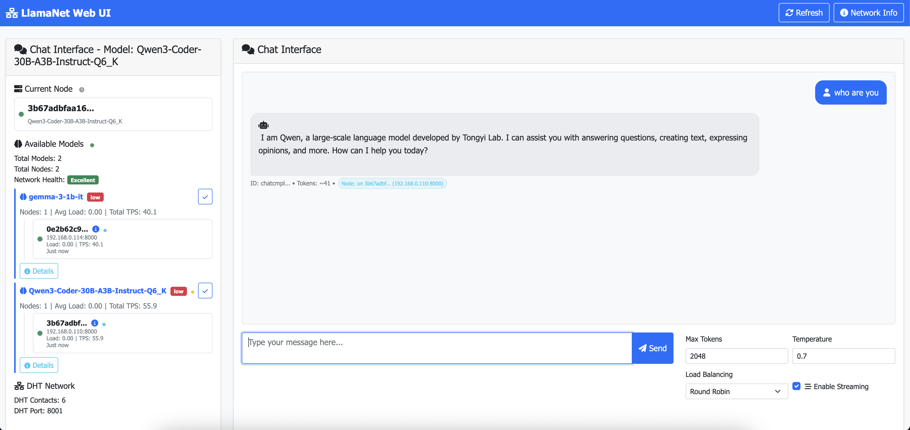

# LlamaNet: Decentralized Inference Swarm for llama.cpp

LlamaNet is a decentralized inference swarm for LLM models using llama.cpp. It provides an OpenAI-compatible API with real-time streaming, automatic node discovery via Kademlia DHT, and no single point of failure.



## Quick Start

### 1. Installation

```bash
git clone https://github.com/machaao/llama-net.git
cd llama-net
pip install -r requirements.txt
```

### 2. Download and Run a Model

```bash
# Using Python module (recommended)
python -m inference_node.server run hf.co/meta-llama/Llama-2-7b-chat-hf:Q4_K_M

# Or using start-app.sh
./start-app.sh run hf.co/meta-llama/Llama-2-7b-chat-hf:Q4_K_M
```

### 3. Access the API

- **Web UI**: http://localhost:8000
- **OpenAI API**: http://localhost:8000/v1/chat/completions
- **Models List**: http://localhost:8000/v1/models

## Supported URL Formats

```bash
hf.co/user/model                 # Latest version
hf.co/user/model:Q4_K_M         # With quantization
user/model:Q4_K_M               # Short format
https://huggingface.co/user/model:Q4_K_M  # Full URL
```

## Working with Gated Models

Some models require authentication:

```bash
# 1. Get token from https://huggingface.co/settings/tokens
huggingface-cli login

# 2. Accept model terms on Hugging Face website
# Visit: https://huggingface.co/LiquidAI/LFM2.5-1.2B-JP-202606-GGUF
# Click "Access repository" and accept terms

# 3. Download and run
python -m inference_node.server run hf.co/LiquidAI/LFM2.5-1.2B-JP-202606-GGUF:Q4_K_M
```

## Running Multiple Nodes

```bash
# Node 1 (Bootstrap)
python -m inference_node.server --model-path ./models/model.gguf

# Node 2 (Join network)
python -m inference_node.server \
  --model-path ./models/model.gguf \
  --port 8002 \
  --dht-port 8003 \
  --bootstrap-nodes localhost:8001
```

## OpenAI-Compatible API

```python
import openai

openai.api_base = "http://localhost:8000/v1"
openai.api_key = "dummy-key"

# Chat completion
response = openai.ChatCompletion.create(
    model="llamanet",
    messages=[{"role": "user", "content": "Hello!"}],
    stream=True
)

for chunk in response:
    if chunk.choices[0].delta.get("content"):
        print(chunk.choices[0].delta.content, end="", flush=True)
```

## Recommended Models

### Getting Started (Small & Fast)
```bash
python -m inference_node.server run hf.co/bartowski/Llama-3.2-3B-Instruct-GGUF:Q4_K_M
```

### Production Use (Balanced)
```bash
python -m inference_node.server run hf.co/bartowski/Meta-Llama-3.1-8B-Instruct-GGUF:Q4_K_M
```

### High Performance (Larger)
```bash
python -m inference_node.server run hf.co/unsloth/Qwen3-30B-A3B-GGUF:Q4_K_M
```

## Troubleshooting

### 401 Unauthorized Error

```bash
# Authenticate with Hugging Face
huggingface-cli login

# Verify authentication
huggingface-cli whoami

# Accept model terms on Hugging Face website
```

### Model Not Found

```bash
# Verify model exists
# Visit: https://huggingface.co/search/models?q=your-model-name

# Use correct format: user/model-name
python -m inference_node.server run hf.co/meta-llama/Llama-2-7b-chat-hf:Q4_K_M
```

### Manual Download Fallback

```bash
# Download using huggingface-cli
huggingface-cli download LiquidAI/LFM2.5-1.2B-JP-202606-GGUF \
  LFM2.5-1.2B-JP-202606-Q4_K_M.gguf \
  --local-dir ./models \
  --local-dir-use-symlinks False

# Run with local path
python -m inference_node.server --model-path ./models/LFM2.5-1.2B-JP-202606-Q4_K_M.gguf
```

## Common Commands

```bash
# Download and run a model
python -m inference_node.server run hf.co/meta-llama/Llama-2-7b-chat-hf:Q4_K_M

# Run with local model
python -m inference_node.server --model-path ./models/model.gguf

# Run with custom port
python -m inference_node.server run hf.co/meta-llama/Llama-2-7b-chat-hf:Q4_K_M --port 8080

# Authenticate with Hugging Face
huggingface-cli login

# Check authentication status
huggingface-cli whoami
```

## Features

- **OpenAI-Compatible API** - Drop-in replacement for OpenAI endpoints
- **Real-time Streaming** - Server-Sent Events for live responses
- **Decentralized Discovery** - Kademlia DHT for node discovery
- **Hardware-Based Node IDs** - Consistent identity across restarts
- **Multi-Node Support** - Automatic load balancing
- **Web UI** - Interactive chat interface
- **No Single Point of Failure** - Fully distributed architecture

## Requirements

- Python 3.8+
- GGUF format models (compatible with llama.cpp)
- 4GB+ RAM (depends on model size)

## Architecture

- **HTTP API**: OpenAI-compatible endpoints on port 8000
- **DHT Network**: Peer discovery on port 8001
- **Web UI**: Interactive interface at http://localhost:8000
- **Streaming**: Real-time responses via Server-Sent Events

## License

Apache License 2.0 - see [LICENSE](./LICENSE) file for details.

## Made with ❤️ using MACH-AI

This project was built with [MACH-AI](https://machai.live)