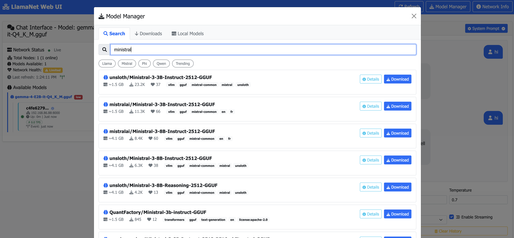

# LlamaNet: Decentralized Inference Swarm for llama.cpp

LlamaNet is a decentralized inference swarm for LLM models using llama.cpp. It provides an OpenAI-compatible API with real-time streaming, automatic node discovery via Kademlia DHT, and no single point of failure.



## Quick Start

### Installation

```bash
git clone https://github.com/machaao/llama-net.git
cd llama-net
pip install -r requirements.txt
```

### Launch LlamaNet

```bash
python -m inference_node.server
```

This starts LlamaNet in **no-model mode**. Open http://localhost:8000 and use the **Model Manager** to search, download, and select a model — all from the browser.

### Or Run a Model Directly

```bash
python -m inference_node.server run hf.co/bartowski/Llama-3.2-3B-Instruct-GGUF:Q4_K_M
./start-app.sh run hf.co/bartowski/Llama-3.2-3B-Instruct-GGUF:Q4_K_M
```

## URL Formats

```bash
hf.co/user/model                 # Latest
hf.co/user/model:Q4_K_M         # With quantization
user/model:Q4_K_M               # Short format
```

## Model Manager

Open the Web UI and click **Model Manager** to:
- Search Hugging Face for GGUF models
- View model details and available quantizations
- Download with real-time progress tracking
- Switch models without restarting (hot-reload)
- Manage and delete local models

## Access

- **Web UI**: http://localhost:8000
- **OpenAI API**: http://localhost:8000/v1/chat/completions

## API Example

```python
import openai

openai.api_base = "http://localhost:8000/v1"
openai.api_key = "dummy-key"

response = openai.ChatCompletion.create(
    model="llamanet",
    messages=[{"role": "user", "content": "Hello!"}],
    stream=True
)

for chunk in response:
    if chunk.choices[0].delta.get("content"):
        print(chunk.choices[0].delta.content, end="", flush=True)
```

## Multi-Node Setup

```bash
# Node 1 (Bootstrap)
python -m inference_node.server --model-path ./models/model.gguf

# Node 2 (Join)
python -m inference_node.server \
  --model-path ./models/model.gguf \
  --port 8002 \
  --dht-port 8003 \
  --bootstrap-nodes localhost:8001
```

## Persistent Cloudflare Tunnel (Internet-Accessible)

LlamaNet supports persistent public URLs via Cloudflare tunnels, enabling anyone on the internet to connect to your node — no port forwarding required.

### Quick Tunnel (No Account Needed)

```bash
# Temporary URL — changes on every restart
./start-app.sh --tunnel

# Or with Python directly:
ENABLE_TUNNEL=true python -m inference_node.server
```

Output:
```
╔══════════════════════════════════════════════════════════════╗
║  🌍 Cloudflare Tunnel Active                                ║
║                                                              ║
║  Public URL: https://abc-123.trycloudflare.com              ║
║                                                              ║
║  Share this URL to access LlamaNet from anywhere.            ║
╚══════════════════════════════════════════════════════════════╝
```

### Named Tunnel (Persistent URL)

For a URL that survives restarts, create a named Cloudflare tunnel:

```bash
# One-time setup (requires free Cloudflare account):
cloudflared tunnel login
cloudflared tunnel create llamanet
cloudflared tunnel route dns llamanet llamanet.yourdomain.com

# Run with persistent tunnel:
./start-app.sh --tunnel --tunnel-name llamanet
```

The URL `https://llamanet.yourdomain.com` stays the same across restarts.

### Custom Domain Setup

If you own a domain (e.g., `llamanet.app`), configure it in Cloudflare DNS:

```
# Cloudflare DNS Records:
bootstrap.llamanet.app  → CNAME → <tunnel-id>.cfargotunnel.com
node2.llamanet.app      → CNAME → <tunnel2-id>.cfargotunnel.com
```

Each operator creates their own tunnel and points their subdomain to it.

### Connecting to a Tunneled Node

**As an API consumer** — just use the URL:
```python
import openai

client = openai.OpenAI(
    base_url="https://bootstrap.llamanet.app/v1",
    api_key="not-needed"
)

response = client.chat.completions.create(
    model="llamanet",
    messages=[{"role": "user", "content": "Hello!"}]
)
```

**As a peer LlamaNet node** — use `--bootstrap-peers`:
```bash
python -m inference_node.server \
  --model-path ./models/model.gguf \
  --tunnel \
  --bootstrap-peers https://bootstrap.llamanet.app
```

This registers your node with the bootstrap peer via HTTP, and other nodes discover you through gossip — no UDP required.

### How It Works

LlamaNet implements a **dual-transport DHT**:

- **UDP (default)**: Used for LAN nodes (fast, zero-overhead discovery)
- **HTTP (tunnel)**: Used for nodes behind Cloudflare tunnels, NAT, or firewalls

Both transports share the same Kademlia routing table. When a node registers via `--bootstrap-peers`, it joins the DHT over HTTP. Other nodes discover it through periodic gossip and DHT lookups route through HTTP when the target peer is behind a tunnel.

```
┌──────────┐  UDP  ┌──────────┐  HTTP  ┌──────────┐
│ Node A   │◄────►│ Node B   │◄─────►│ Node C   │
│ LAN      │      │ LAN +    │       │ Tunnel   │
│          │      │ bootstrap│       │          │
└──────────┘      └──────────┘       └──────────┘
```

### API Endpoints

| Method | Endpoint | Description |
|--------|----------|-------------|
| GET | `/peers` | List known peers (HTTP-discovered + DHT) |
| POST | `/peers/register` | Register as a peer |
| GET | `/tunnel/status` | Get tunnel status and public URL |
| POST | `/dht/rpc` | DHT protocol messages over HTTP |

## Docker Setup

LlamaNet includes Docker support with automatic GPU/CPU detection and no-model mode.

```bash
# Build and start a 3-node network
docker-compose -f docker/docker-compose.yml up -d

# Start a no-model router node (downloads model via Web UI)
docker run -d \
  --name llamanet-router \
  -p 8000:8000 \
  -p 8001:8001/udp \
  -v llamanet-models:/root/.llamanet/models \
  -e BOOTSTRAP_NODES="" \
  llamanet
```

See [docker/README.md](./docker/README.md) for full Docker documentation including GPU setup, environment variables, and scaling.

## API Endpoints

| Method | Endpoint | Description |
|--------|----------|-------------|
| GET | `/v1/models` | List models |
| POST | `/v1/chat/completions` | Chat completion |
| POST | `/v1/completions` | Text completion |
| GET | `/models/search?q=...` | Search HF models |
| POST | `/models/download` | Download model |
| GET | `/models/local` | List local models |
| POST | `/models/select` | Switch model |
| GET | `/health` | Health check |
| GET | `/status` | Node status |
| GET | `/events/network` | Network SSE |

## Features

- OpenAI-compatible API
- Model Manager with hot-reload
- No-model mode for first-time setup
- Chat format auto-detection
- Reasoning model support (DeepSeek-R1, etc.)
- Real-time streaming via SSE
- Kademlia DHT node discovery
- Hardware-based node IDs
- Load balancing (Round Robin, Load Balanced, Random)
- Request queuing
- System prompt customization

## Gated Models

```bash
huggingface-cli login
# Accept terms on Hugging Face website, then download via Model Manager or:
python -m inference_node.server run hf.co/LiquidAI/LFM2.5-1.2B-JP-202606-GGUF:Q4_K_M
```

## Troubleshooting

```bash
# Verify HF authentication
huggingface-cli whoami

# Manual download fallback
huggingface-cli download user/model file.gguf --local-dir ./models
python -m inference_node.server --model-path ./models/file.gguf
```

## Requirements

- Python 3.8+
- GGUF format models
- 4GB+ RAM (depends on model size)

## Architecture

- HTTP API on port 8000 (OpenAI-compatible)
- DHT Network on port 8001 (peer discovery)
- Web UI at http://localhost:8000
- SSE for real-time updates (no polling)

## License

Apache License 2.0 - see [LICENSE](./LICENSE)

## Made with ❤️ using MACH-AI

Built with [MACH-AI](https://machai.live)
